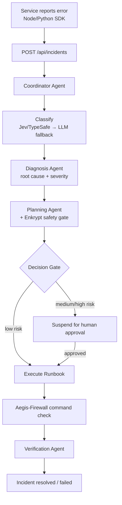

# AegisSRE

**A governed, multi-agent incident response system.** Services report errors via SDK; a Mastra agent pipeline classifies, diagnoses root cause, and — for known failure modes — auto-remediates through vetted runbooks, gated by risk tier and a command-level safety firewall.

---

## How it works



1. **Report** — an external service (or a script like [Aegis-Firewall's](../Aegis-Firewall) `aegis.py`) POSTs an error to `/api/incidents` via the Node or Python SDK.
2. **Classify** — a fast Jev/TypeSafe classifier (or an LLM fallback if `TYPESAFE_API_KEY` is unset) categorizes the failure and affected service.
3. **Diagnose** — the Diagnosis Agent correlates log/metric tool output into a root cause and severity.
4. **Plan** — the Planning Agent proposes a runbook, screened by the Enkrypt AI policy gate.
5. **Gate** — the Decision Gateway auto-approves `low` risk-tier runbooks; everything else suspends the workflow until a human approves via the dashboard or `POST /api/incidents/:id/approve`.
6. **Execute** — each shell command in the runbook is checked against **Aegis-Firewall** (a sibling MCP-based policy engine) before it runs; a `BLOCK` verdict fails that command, and a firewall-unreachable check fails open (with the decision surfaced in the UI either way).
7. **Verify** — the Verification Agent confirms recovery from post-execution telemetry.

If the primary LLM rate-limits, `generateWithFailover()` retries once, then falls back to a local Ollama model in tool-free mode so triage never fully stalls.

---

## Features

- **Multi-agent Mastra pipeline** — Coordinator, Classifier, Diagnosis, Planning, Execution, Verification agents, orchestrated as a single suspendable `incidentWorkflow`.
- **Risk-tiered auto-remediation** — runbooks are matched by confidence against the diagnosis; `low`-risk ones execute autonomously, anything higher suspends for human approval.
- **Aegis-Firewall command gate** — every runbook shell command is screened by a separate MCP-based policy engine (JevGuard) for credential access, destructive deletes, privilege escalation, etc., before it's allowed to run.
- **Provider failover** — OpenAI → Groq → local Ollama, so a rate limit on one provider doesn't stall incident response.
- **SDKs** — Node (`packages/sdk`) and Python (`packages/sdk-python`) clients so any service can report incidents with two lines of code.
- **Live dashboard** — Next.js UI with a real-time workflow visualization, per-operation firewall verdicts, telemetry panel, and incident chat.
- **OpenTelemetry tracing** — every API route and workflow step is wrapped in a span, exported to SigNoz.

---

## Tech stack

| Category | Technology |
|---|---|
| Framework | Next.js 16 (Turbopack), TypeScript, React 19 |
| Agent orchestration | [Mastra](https://mastra.ai) |
| LLM providers | OpenAI (`gpt-4o-mini`) → Groq (`gpt-oss-120b`) → local Ollama fallback |
| Fast classification | [TypeSafe](https://typesafe.ai) (Jev System One), LLM fallback |
| Safety gate | Enkrypt AI policy proxy (plan-level), Aegis-Firewall/JevGuard (command-level, via MCP) |
| Observability | OpenTelemetry SDK, exported to SigNoz |
| Storage | LibSQL (Mastra state/traces), in-memory incident store |
| SDKs | `@aegis-sre/sdk` (Node), `aegis-sre-sdk` (Python) |

---

## Getting started

### Prerequisites

- Node.js 18+
- An OpenAI or Groq API key (at least one required)

### Installation

```bash
git clone https://github.com/ghoshvidip26/AegisSRE-MastraAI.git
cd AegisSRE-MastraAI
npm install
git config core.hooksPath .githooks
```

The last line enables the pre-commit secret scan (`.githooks/pre-commit`) — `core.hooksPath` is a local git setting, so each clone needs to run it once.

### Environment setup

Copy `.env.example` to `.env` and fill in what you need:

```env
# At least one LLM provider is required (precedence: OpenAI, then Groq)
OPENAI_API_KEY=
GROQ_API_KEY=
OLLAMA_BASE_URL=            # local fallback model, optional

# Fast incident classification — falls back to an LLM agent if unset
TYPESAFE_API_KEY=

# Observability
SIGNOZ_URL=
SIGNOZ_API_KEY=

# Plan-level safety gate
ENKRYPT_API_KEY=
ENKRYPT_BASE_URL=

# Require Authorization: Bearer <key> on POST /api/incidents. Unset = no auth.
AEGIS_API_KEY=

# Command-level firewall (JevGuard/Aegis-Firewall). Unset = commands run unchecked.
AEGIS_FIREWALL_MCP_PATH=
AEGIS_FIREWALL_PYTHON=
```

### Run

```bash
npm run dev
```

Open [http://localhost:3000](http://localhost:3000).

---

## Reporting incidents from another service

### Node

```ts
import { AegisClient } from "@aegis-sre/sdk";

const aegis = new AegisClient({
  baseUrl: "http://localhost:3000",
  service: "payments-api",
  apiKey: process.env.AEGIS_API_KEY, // only needed if the server sets AEGIS_API_KEY
});

await aegis.report({ message: "Connection pool exhausted" });
// or: aegis.installGlobalHandlers() to auto-capture uncaught exceptions
```

### Python

```python
from aegis_sre import AegisClient

client = AegisClient(base_url="http://localhost:3000", api_key=os.environ.get("AEGIS_SRE_API_KEY"))
client.create_incident(service="redis", message="Redis ping failed: connection refused", severity="P1")
```

Both SDKs only attach the `Authorization` header when an API key is passed — if the server has `AEGIS_API_KEY` set, every caller must supply the matching key or the request is rejected with `401` before an incident is ever created.

---

## API

| Route | Method | Purpose |
|---|---|---|
| `/api/incidents` | `POST` | Create an incident (`service`, `message` required) and kick off the async diagnosis/remediation workflow. |
| `/api/incidents` | `GET` | List all incidents. |
| `/api/incidents/:id` | `GET` | Fetch one incident. |
| `/api/incidents/:id/approve` | `POST` | Approve or reject a suspended (non-low-risk) runbook. |
| `/api/incidents/:id/trace` | `GET` | Fetch the OpenTelemetry trace for an incident. |
| `/api/chat` | `POST` | Streaming chat with the Coordinator Agent, scoped to an incident. |

---

## Runbooks

| ID | Description | Risk tier |
|---|---|---|
| `redis-restart` | Restart local Redis when it's unreachable or the connection pool is exhausted. | low (auto) |
| `llm-rate-limit` | Recover LLM pipeline degradation: probe primary, retry once, fail over to Ollama. | low (auto) |
| `git-branch` | Check for divergence between remote and local branches. | medium (approval) |
| `node-version` | Detect a Node version mismatch against project requirements. | medium (approval) |

Only `low`-risk runbooks execute autonomously; everything else suspends the workflow until approved via the dashboard or the approve endpoint.

---

## Project structure

```
AegisSRE-Signoz/
├── app/
│   ├── api/
│   │   ├── chat/                  # Streaming chat endpoint
│   │   ├── incidents/             # Create/list/approve/trace endpoints
│   │   └── telemetry/health/      # Health check
│   └── page.tsx                   # Dashboard
├── components/
│   ├── dashboard/                 # Sidebar, workflow canvas, telemetry panel
│   └── incident-details/          # Workflow stages, firewall badges, verification checklist
├── src/
│   ├── agents/                    # Coordinator, Classifier, Diagnosis, Planning, Execution, Verification
│   ├── workflows/                 # incidentWorkflow — the suspendable state machine
│   ├── runbooks/                  # Registered runbooks + local shell executor
│   ├── services/                  # Enkrypt gate, Aegis-Firewall MCP client, Jev classifier client
│   ├── tools/                     # log/metrics/delegate tools wired into the Coordinator
│   ├── prompts/                   # Agent prompts
│   └── mastra/index.ts            # Mastra instance — all agents/workflows registered here
├── lib/
│   ├── incidents/                 # In-memory incident store
│   ├── auth.ts                    # AEGIS_API_KEY bearer-token check
│   └── tracing.ts                 # OpenTelemetry tracer setup
├── packages/
│   ├── sdk/                       # Node SDK (@aegis-sre/sdk)
│   └── sdk-python/                # Python SDK (aegis-sre-sdk)
├── scripts/
│   └── test-firewall.ts           # Standalone Aegis-Firewall connectivity test
└── docs/                          # CRISPE prompts, requirements, security specs
```

---

## Testing

```bash
npm run test:firewall   # verifies the Aegis-Firewall MCP connection end-to-end
```

---

## License

MIT © AegisSRE Team
